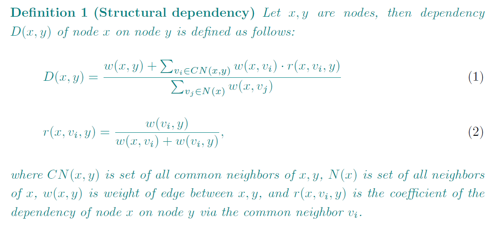

# Non-Symmetric Structural Dependency

This repository contains implementation of non-symmetric structural similarity between pairs of nodes, which we refer to as dependency. This dependency can be used, thanks to non-symmetry, to accurately describe the prominent nodes in the zones which are responsible for large zone overlaps and the reasons why overlaps occur.

More background information and specific use case can be found in the original [article](https://appliednetsci.springeropen.com/articles/10.1007/s41109-019-0192-6).

## Algorithm

This repository contains implementation of algorithm by following definition.

## Contribution

Author: Milos Kudelka - milos.kudelka@vsb.cz

Implementation: Jakub Plesník - jakub.plesnik.st@vsb.cz

Fell free to create pull request with fixes or enhancements.

## Disclaimer

Algorithm is implemented with focus on readability so there is minimum of performance optimalizations.

## Licence

The algorithm is published under MIT licence.
